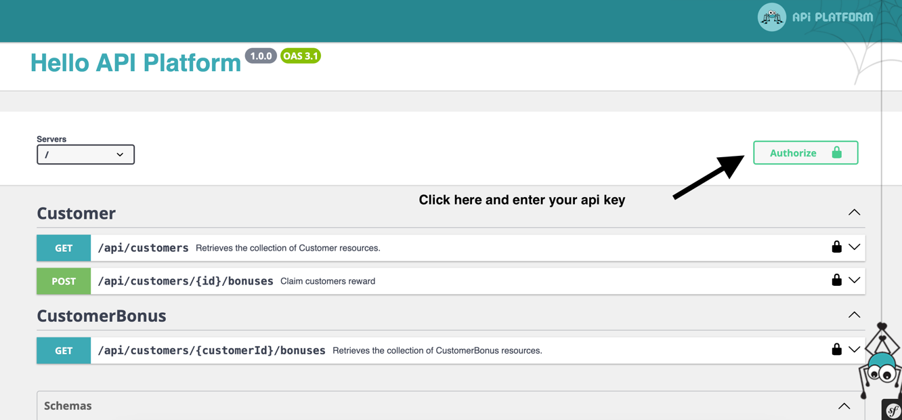

## Bonus Reward Service

### Overview
This service implements the following logic: There is a resource called Bonus, which contains the following elements:
- id
- name
- reward

There are two types of rewards:
- Smile
- Hug

### Client
The client has the following attributes:
- id
- isEmailVerified
- isBirthday

### Bonus
When the client interacts with the service via RestAPI (sending isEmailVerified and isBirthday parameters in the request), they receive a reward for the bonus depending on the conditions met:
- If isEmailVerified, they receive rewards in Smile.
- If isBirthday, they receive rewards in Hug.

The client can receive a reward only once in each bonus. The response from the service should include a list of bonus IDs in which the client received a reward.

### Additional Route
There is a second route for the client to query the service, where the service will provide a list of rewards the client has received. The client can specify the number of records they want to receive in the request, and pagination is supported. The response from the service includes:
- Bonus name
- Reward
- Time of reward claim


# Installation
```bash
make build 
``` 

# Testing
```bash
make test 
``` 

# Features
The task is done via ApiPlatform

API_KEY=t04mBxlhXP


